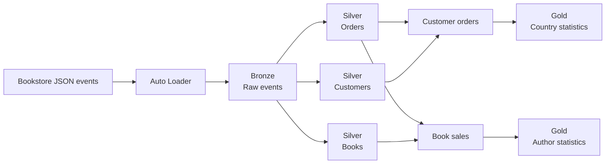

# Databricks Bookstore Lakehouse

An end-to-end Databricks data engineering project that processes simulated bookstore events into analytics-ready datasets. It implements a medallion architecture using incremental ingestion, Structured Streaming, Delta Lake, change data capture, data-quality controls, dimensional modeling, and governed analytics.

The repository includes two implementations of the pipeline:

- A nine-task Databricks job built with PySpark and Spark SQL.
- A declarative Databricks pipeline built with `pyspark.pipelines` and SQL.

## Architecture



## Pipeline layers

### Bronze

- Incrementally ingests JSON files with Databricks Auto Loader.
- Preserves Kafka-style metadata such as topic, partition, offset, and timestamp.
- Stores raw events in an append-only Delta table partitioned by topic and year-month.

### Silver

- Parses the multiplexed `orders`, `customers`, and `books` event topics.
- Deduplicates orders using event-time watermarks and business keys.
- Applies customer CDC updates with `foreachBatch` and Delta Lake `MERGE`.
- Enriches customers with country reference data using a broadcast join.
- Tracks historical book-price changes with Slowly Changing Dimension Type 2 logic.
- Creates customer-order and book-sales datasets with streaming joins.

### Gold

- Aggregates daily order and book counts by country.
- Calculates author sales metrics in event-time windows.
- Publishes analytics through tables, views, and materialized views.

## Key features

- Checkpointed Spark Structured Streaming with `availableNow` triggers.
- Delta Lake ACID transactions, `MERGE`, Change Data Feed, history, and time travel.
- Data-quality expectations, quarantine handling, table constraints, and validation checks.
- CDC processing and downstream propagation of customer deletion requests.
- Dynamic masking of customer data and row-level filtering through governed views.
- Stream-to-stream and stream-to-static joins.
- Declarative streaming tables, materialized views, Auto CDC, and SCD Type 2 flows.

## Technology stack

- Databricks
- Apache Spark and PySpark
- Spark Structured Streaming
- Spark SQL
- Delta Lake
- Databricks Auto Loader
- Databricks Jobs and declarative pipelines
- Unity Catalog and volumes
- Python and pandas UDFs

## Repository structure

```text
.
├── Bookstore Pipeline/       # Declarative pipeline transformations
├── Multiple Task Jobs/       # Ordered Databricks job tasks
├── Modeling Data/            # Ingestion, quality, deduplication, and SCD examples
├── Processing Data/          # CDC, Change Data Feed, joins, and aggregations
├── Data Governance/          # Access-control and delete-propagation examples
├── Copy-Datasets.ipynb       # Dataset setup and shared processing utilities
├── Custom Functions.ipynb    # Python, SQL, and pandas UDF examples
└── Reset and Rebuild.ipynb   # Development-environment cleanup
```

## Running the project

### Requirements

- A Databricks workspace with Unity Catalog enabled.
- Compute that supports PySpark, Delta Lake, and Structured Streaming.
- Permission to create schemas, volumes, tables, and views.

### Setup

1. Clone or import the repository into a Databricks workspace.
2. Run `Copy-Datasets.ipynb` to initialize the schema, volumes, and sample data.
3. Run the notebooks under `Multiple Task Jobs` in numeric order, or configure a declarative pipeline using the files under `Bookstore Pipeline/transformations`.
4. Set the declarative pipeline's `dataset_path` configuration to the initialized dataset volume.

This project is intended to run on Databricks and depends on Databricks utilities, Unity Catalog, Delta Lake, and Spark Structured Streaming.
