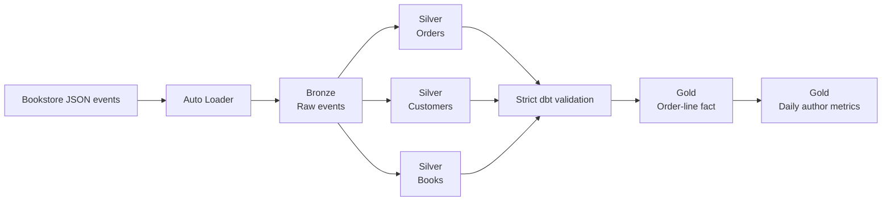

# Databricks Bookstore Lakehouse

An end-to-end Databricks data engineering project that processes simulated bookstore events into analytics-ready datasets. It implements a medallion architecture using incremental ingestion, Structured Streaming, Delta Lake, change data capture, data-quality controls, dimensional modeling, and governed analytics.

The repository includes two implementations of the pipeline:

- A nine-task Databricks job built with PySpark and Spark SQL.
- A declarative Databricks pipeline built with `pyspark.pipelines` and SQL.

## Architecture



## Pipeline layers

### Bronze

- Incrementally ingests JSON files with Databricks Auto Loader.
- Preserves Kafka-style metadata such as topic, partition, offset, and timestamp.
- Stores raw events in an append-only Delta table partitioned by topic and year-month.

### Silver

- Parses the multiplexed `orders`, `customers`, and `books` event topics.
- Deduplicates orders using event-time watermarks and business keys.
- Applies customer CDC updates with `foreachBatch` and Delta Lake `MERGE`.
- Enriches customers with country reference data using a broadcast join.
- Tracks historical book-price changes with Slowly Changing Dimension Type 2 logic.
- Creates customer-order and book-sales datasets with streaming joins.

### Gold

- Uses dbt to validate Silver contracts before publishing analytics.
- Explodes nested orders into an incremental order-line fact.
- Prices each line from the SCD Type 2 book version valid at order time.
- Publishes tested daily author metrics with enforced model contracts.

## Key features

- Checkpointed Spark Structured Streaming with `availableNow` triggers.
- Delta Lake ACID transactions, `MERGE`, Change Data Feed, history, and time travel.
- Data-quality expectations, quarantine handling, table constraints, and validation checks.
- CDC processing and downstream propagation of customer deletion requests.
- Dynamic masking of customer data and row-level filtering through governed views.
- Stream-to-stream and stream-to-static joins.
- Declarative streaming tables, materialized views, Auto CDC, and SCD Type 2 flows.
- Strict dbt freshness, source, unit, relationship, and reconciliation tests.
- Stored test failures, sanitized validation results, and a read-only Databricks report.

## Strict dbt validation

The Databricks job refreshes the declarative Silver pipeline, then runs dbt as a blocking quality gate before Gold data is published:

```text
Lakeflow pipeline
    → source freshness
    → Silver contract tests
    → dbt unit tests and Gold build
    → validation report
```

- `stg_orders`, `stg_customers`, and `stg_books_history` standardize the Silver interfaces without exposing customer names, email addresses, or street addresses.
- `int_order_lines` preserves array position and creates a deterministic order-line key. Historical prices are selected from the SCD Type 2 book version valid when each order occurred.
- `fct_order_line` is an incremental Delta model, and `agg_author_daily` publishes daily orders, units, and gross sales by author.
- Freshness, schema, uniqueness, relationship, range, SCD overlap, subtotal, and aggregate-reconciliation violations fail the job with zero tolerated failures.
- Safe failure rows are stored in `bookstore_dbt_audit`; invocation status is written to `ops_dbt_validation_results`. The read-only report runs on both successful and failed validations while preserving the dbt task's failure state.

## Technology stack

- Databricks
- Apache Spark and PySpark
- Spark Structured Streaming
- Spark SQL
- Delta Lake
- Databricks Auto Loader
- Databricks Jobs and declarative pipelines
- Unity Catalog and volumes
- dbt Core with `dbt-databricks`
- Declarative Automation Bundles
- Python and pandas UDFs

## Repository structure

```text
.
├── Bookstore Pipeline/       # Declarative pipeline transformations
├── Multiple Task Jobs/       # Ordered Databricks job tasks
├── Modeling Data/            # Ingestion, quality, deduplication, and SCD examples
├── Processing Data/          # CDC, Change Data Feed, joins, and aggregations
├── Data Governance/          # Access-control and delete-propagation examples
├── dbt_bookstore/            # Strict validation and tested Gold models
├── resources/                # Source-controlled Databricks pipeline and job
├── Validation/               # Read-only validation report notebook
├── databricks.yml            # Bundle variables and development target
├── Copy-Datasets.ipynb       # Dataset setup and shared processing utilities
├── Custom Functions.ipynb    # Python, SQL, and pandas UDF examples
└── Reset and Rebuild.ipynb   # Development-environment cleanup
```

## Running the project

### Requirements

- A Databricks workspace with Unity Catalog enabled.
- A serverless or pro SQL warehouse for the native dbt task.
- Databricks CLI with bundle support.
- Permission to create schemas, volumes, tables, and views.

### Setup

1. Clone or import the repository into a Databricks workspace.
2. Run `Copy-Datasets.ipynb` to initialize the schema, volumes, and sample data.
3. Stage pipeline input with `Bookstore Pipeline/explorations/dataset.py`.
4. Validate and deploy the bundle with a SQL warehouse ID:

   ```bash
   databricks bundle validate --var warehouse_id=<warehouse-id>
   databricks bundle deploy --var warehouse_id=<warehouse-id>
   ```

5. Run the pipeline, strict dbt gate, and validation report:

   ```bash
   databricks bundle run bookstore_strict_validation --var warehouse_id=<warehouse-id>
   ```

The default bundle target uses the `main` catalog, `bookstore_eng_pro` Silver schema, `bookstore_gold_dev` Gold schema, and `bookstore_dbt_audit` validation schema. Override bundle variables when the workspace uses different names.
